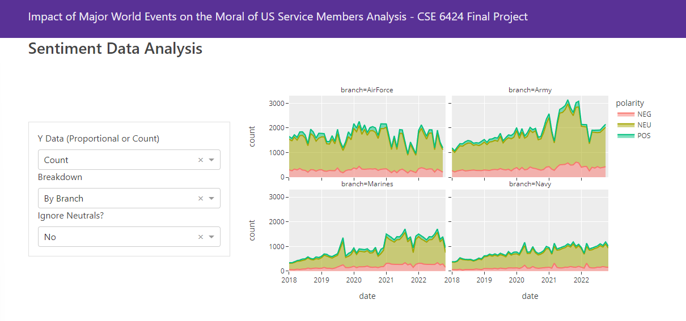

# CSE 6424 - Final Project

Our data collection and analysis scripts, and our dashboard for visualizating and understanding the data collected. (All data for the dashboard is precomputed into this repo).



## How to setup

In order to run the project you will need to install Python 3.10. Head to https://www.python.org/ to figure out how to install and download.

Next in your terminal, we will need to install `pipenv`, a tool that takes care of both package management and creating a virtual environment. To do this run the following command.

```bash
pip install pipenv
```

Once installed navigate to the folder for this project and run the following command.

```bash
pipenv install
```

This will create a virtual environment and install all the preqrueiesti packages you'll need to be able to run the web app and the project.

## How to run the web app

To run the web app is very simple, you'll only need to run this one command using `pipenv` to get the dashboard to come alive.

```
pipenv run python -m dashboard
```


That's seriously it, no more work needs to be done!!!!

## How to obtain data and perform experiment


